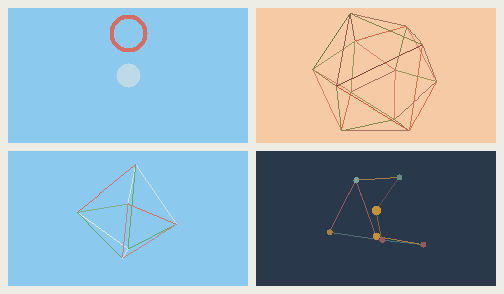
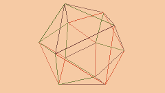
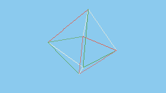
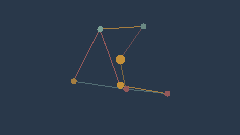

# Rill Drums

**rill** /rɪl/ *noun* — a small stream or a tiny, shallow channel cut into soil by running water.

A generative percussion instrument for the **M5Stack StickS3**. Seven drum voices form slowly evolving grooves with reactive visuals. Tap for a new kit and pattern. Shake for a new visual. Sound and visuals run entirely on the device, without Wi-Fi or an account.

[Play Rill Drums](https://rillsound.com/drums) · [Get on M5Burner](https://burner.m5stack.com/firmware/2102132800601452545) · [Build and install](#build-and-install)

**Rill family:** [Synth](https://github.com/bruceblay/rill-synth) · [Mallet](https://github.com/bruceblay/rill-mallet) · [World](https://github.com/bruceblay/rill-world) · [Drums](https://github.com/bruceblay/rill-drums) · [Rill Sound](https://rillsound.com)

## Visuals

Four visual families follow the groove in flat ink and daylight palettes. Shake changes the visual without interrupting the drums.

| Rings | Icosahedron |
| --- | --- |
|  |  |
| **Diamond** | **Orbit** |
|  |  |

Actual 240 × 135 renderer captures, generated with `tools/visual_preview.cpp` using seed 17 and active family indices 0, 3, 4 and 5. Rings expand with hits; wireframes and Orbit light their edges and nodes with each voice.

## Play

| Gesture | Action |
| --- | --- |
| Front button: tap | Generate a new kit character and groove, change the visual, and play |
| Front button: hold for about 0.65 seconds | Fade sound out or in; the groove continues while quiet |
| Side button: tap | Cycle volume and show the data view for four seconds |
| Side button: hold | Slow the whole ensemble by 4 BPM, starting on the bar after next; below 52 it comes round to 100 |
| Shake | Immediately switch to a different visual, without changing the groove |

The data view shows the kit character, activity (sparse, steady or full), generation, tempo, bar count, volume and battery estimate.

## Sound

- **Seven drum voices:** Kick, Snare, Closed Hat, Open Hat, Wood, Tom and Rim. Wood is a pitched hollow woodblock in place of the clap a drum machine would usually put there, which read as too bright and gregarious next to the rest; it sits well below the rim's thin tick and rings where the rim is instant. Each channel is monophonic and retriggers rather than stacking copies, the way a real drum machine's voices behave; a closed hat chokes a still-ringing open hat.
- **Seven kit characters:** Skin, Box, Brush, Clay, Glass, Felt and Wire tune toward a hand-drum, electronic, brushed, woody, bright, muffled or metallic feel. One nod to Rill's seven timbres. Kick and Tom are live-synthesized (pitch-swept sine); Snare, Closed/Open Hat, Wood and Rim play back one-shot samples rendered offline per kit, since procedural noise synthesis for those voices never sounded right no matter how it was filtered or layered.
- **A generative groove:** sixteen-step Euclidean-style patterns per voice, rigidly on the grid but with velocity varying hit to hit, slowly mutating density and phase every few bars, and light swing that wanders bar to bar rather than sitting at one fixed amount. Fills vary in length, shape (a tom roll, alternating tom/rim, or a snare run-up) and build in velocity toward the downbeat each time one comes around, instead of a single fixed tag. Quiet ghost notes fall between the pattern's own hits, and the closed hat occasionally breaks into a run, splitting a step into two or four rapid hits so the groove changes note length rather than only adding and removing notes. The open hat never sounds on the same step as the closed hat.
- **Six punch-in effects:** in the spirit of the punch-in FX on Teenage Engineering's Pocket Operator and EP-133 K.O. II instruments, one semi-randomly punches in every so often for about a bar, then clears itself. Each one keeps moving while it's active rather than sitting at one flat setting: Stutter accelerates through three shrinking loop lengths, Bit Crush and Lo-Fi wobble/step their quantization over the window, Feedback swells in and back out, and Octave Down glides the pitch down and back rather than snapping. The screen names the current one for as long as it's engaged.
- **A short room ambience:** a small comb-and-diffuser send, tuned far shorter than Rill's echo, meant only to glue the seven voices together without smearing the groove.
- **An always-on dub delay:** a tempo-synced feedback delay with tape-style darkening and a slow pitch wobble on the repeats, sitting under the mix at a modest level all the time rather than only on the punch. The Dub Echo punch throws its feedback, mix, wobble and tap length up temporarily on the same line instead of switching a separate effect on and off.

Grooves are not saved across restarts. Near other Rill devices (Synth, Mallet or World) it joins an ensemble over ESP-NOW with no setup, keeping its groove on the shared tempo and bar line. In an ensemble a tap waits for the next shared bar, so a new piece comes in on the downbeat without leaving the beat. See [how it works](https://github.com/bruceblay/rill-synth/blob/main/SYNC-DESIGN.md).

## Hardware

Supported and tested: **M5Stack StickS3**, with ESP32-S3, 8 MB flash, display, IMU and built-in speaker. Other ESP32 boards and earlier M5Stick models are not supported by this configuration.

The PlatformIO board name is `esp32-s3-devkitc-1`; the project supplies the StickS3 memory settings and uses M5Unified for board peripherals.

## Build and install

Install Python 3.11 or later, then run these commands from the repository root:

```sh
python3 -m venv .venv
source .venv/bin/activate
python -m pip install -r requirements-dev.txt
pio run
```

On Windows, activate with `.venv\Scripts\activate` instead. PlatformIO downloads the pinned platform and library dependencies on the first build.

Connect the StickS3 with a USB data cable, locate its port with `pio device list`, then install:

```sh
python tools/flash.py --port YOUR_DEVICE_PORT
```

Flashing replaces the firmware currently on the device. The script builds and uploads, then applies the watchdog reset used successfully during Rill's development; a normal RTS reset can leave this board in download mode.

To observe diagnostics:

```sh
pio device monitor --port YOUR_DEVICE_PORT --baud 115200
```

Close the monitor before another upload.

## Develop without hardware

Host tools use the same C++ synthesis and visual code as the firmware. A C++17 compiler is required.

```sh
python tools/test.py
mkdir -p build
c++ -std=c++17 -O2 tools/render.cpp -o build/render
build/render build/drums.wav 60 42
c++ -std=c++17 -O2 tools/visual_preview.cpp -o build/visual_preview
build/visual_preview build/preview.ppm 17 0
```

The audio arguments are output path, seconds, and optional seed. The visual arguments are output path, seed, and optional visual family (0 rings, 3 icosahedron, 4 diamond, 5 orbit; Grid and Radial Grid are currently excluded from selection). Audio output is mono 32 kHz / 16-bit WAV; visual output is PPM. For host address/undefined-behavior checks, run `python tools/test.py --sanitize` with a compatible compiler. Set `CXX` to choose a compiler.

Tests cover five simulated minutes of groove per seed, bounded output, seed reproducibility, the open/closed hat exclusion rule, kit and activity coverage, all six punch-in effects firing and staying within headroom, and shake gesture recognition. They do not replace listening or checking the physical screen.

## Project layout

- `src/Kit.h` — drum synthesis/sample playback and generative groove
- `src/Samples.h` — embedded one-shot PCM samples (Snare, Hats, Wood, Rim), 7 kits
- `src/Pulse.h` — procedural visual families
- `src/main.cpp` — audio, display, buttons and motion tasks
- `src/ShakeDetector.h` — gesture recognition, shared with Rill
- `tools/` — portable tests, auditions, previews and flashing
- `tests/` — host verification

## Credits and license

Created by Bruce Blay, in the spirit of [Rill](https://github.com/bruceblay/rill-synth). Developed through iterative on-device listening and viewing, with Claude assisting implementation.

Rill Drums follows Rill's parent project Pocket Radio's **GPL-3.0-or-later** license. See [LICENSE](LICENSE).
